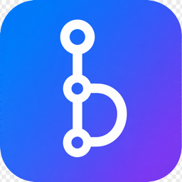
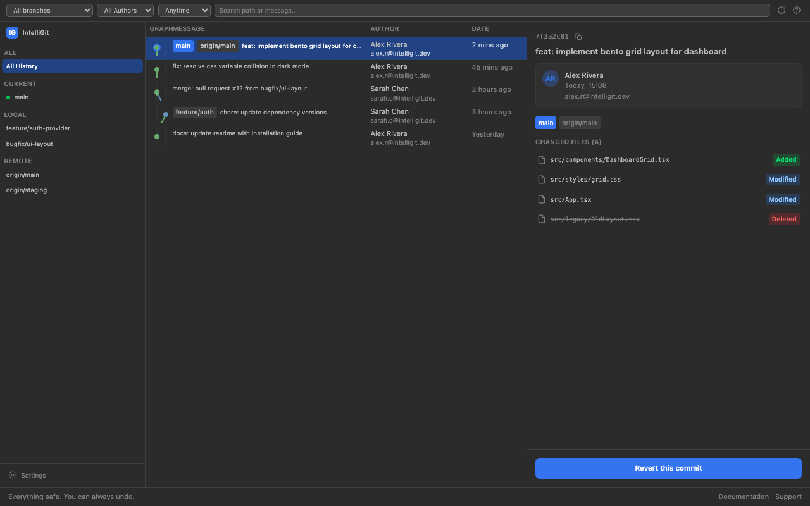
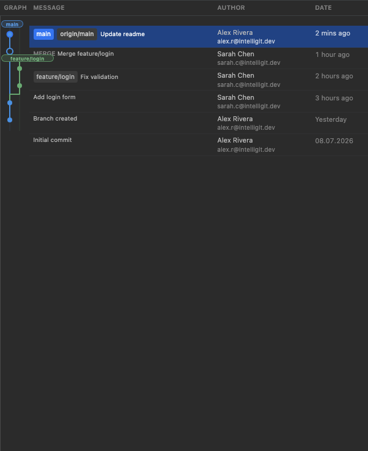
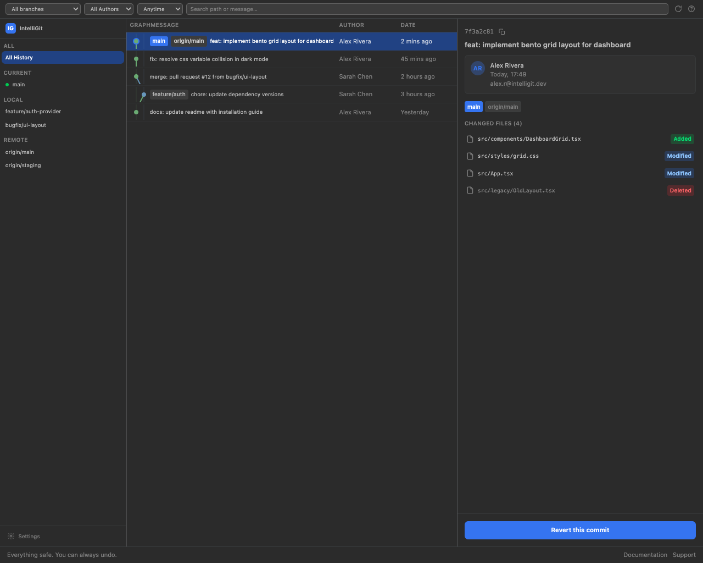

<p align="center">
  
</p>

<h1 align="center">IntelliGit</h1>

<p align="center">
  <strong>Visual Git for VS Code — without the jargon.</strong><br />
  A commit graph, plain-language rebase, branch switching, and side-by-side conflict resolution — all in one panel.
</p>

<p align="center">
  <a href="https://marketplace.visualstudio.com/items?itemName=ArisNgoy.intelligit-visual-git">
    
  </a>
  <a href="https://github.com/Aris-ngoy/intelligit/blob/main/LICENSE">
    
  </a>
  <a href="https://github.com/Aris-ngoy/intelligit/actions">
    
  </a>
</p>

<p align="center">
  
</p>

---

## Why IntelliGit?

Most Git tools assume you already speak Git. IntelliGit doesn't.

- **Plain language everywhere** — "Move my work", "Tidy up changes", "Keep mine / Keep theirs" instead of rebase flags and merge markers.
- **One panel, whole workflow** — history, sync, commit, branches, rebase, and conflicts without leaving VS Code.
- **Built to feel safe** — confirmations before destructive actions, stash prompts before branch switches, and a standing reminder: *everything safe. you can always undo.*

Inspired by the focused Git tooling in JetBrains IDEs — rebuilt natively for VS Code.

---

## Install

1. Open **Extensions** in VS Code (`Cmd+Shift+X` / `Ctrl+Shift+X`).
2. Search for **IntelliGit**.
3. Click **Install**.

Or from the command line:

```bash
code --install-extension ArisNgoy.intelligit-visual-git
```

Open the **IntelliGit** icon in the Activity Bar to get started.

---

## Features

### IntelliGit panel — your command center

Everything flows from a single sidebar, grouped by how often you reach for it:

| Section | What you can do |
| --- | --- |
| **History** | Open the full commit graph · Refresh branches and commits |
| **Sync** | Pull · Push · Fetch |
| **Workspace** | Commit staged changes · Manage stashes |
| **Branches** | Switch branch · Create a new branch |
| **Rebase & merge** | Guided rebase · Interactive tidy-up · Resolve conflicts |

The header always shows your current branch with a live status dot — it updates the moment you switch or create a branch.

---

### Visual Git log

Explore your repository as a living graph, not a wall of hashes.

- **Branch tree** — filter by current, local, or remote branches
- **Lane graph** — see merges, forks, and tags at a glance
- **Smart filters** — branch scope, author, date range, and message/path search
- **Detail panel** — changed files with add/modify/delete badges, author info, and one-click revert
- **Right-click any commit** — cherry-pick, check out, copy hash, start a rebase from here, and more

<p align="center">
  
</p>

Open the full-screen log from the panel (**Git History**) or run **IntelliGit: Open Git Log**.

<p align="center">
  
</p>

---

### Branches — create and switch without the terminal

Branching is a daily action. IntelliGit puts it right in the sidebar.

- **Switch Branch…** — quick-pick of local branches (current marked) plus remote branches grouped separately; checks out tracking branches automatically
- **New Branch…** — name your branch, branch from the current commit, and choose to switch immediately or stay put
- **Safe switching** — if uncommitted changes would be overwritten, you get a clear prompt: *stash them first?* with **Stash & Switch** or **Cancel**

---

### Sync — pull, push, fetch

Keep your local repo in step with the remote in one click from the panel. No terminal, no memorizing flags.

---

### Commit — write and save

A dedicated commit panel for staging your work:

- Stage and unstage individual files or everything at once
- Write your message with commit templates (co-authored-by, issue links, and more)
- Amend the last commit when you need a quick fix-up

---

### Stashes — search, apply, delete

Save work-in-progress without losing it. Browse stashes, apply them back, or clean up — all from a focused stash manager.

---

### Rebase — move my work

A guided two-step dialog replaces the guesswork:

1. See the branch you're moving (your current work)
2. Pick where to put it — usually `main`

Advanced flags (`--autostash`, `--no-verify`, …) stay tucked away until you need them.

<p align="center">
  
</p>

---

### Tidy up changes — interactive rebase, plain language

Turn a messy commit history into a clean story — without touching a `pick/squash/fixup` todo file.

Each commit becomes a card with four plain-language actions:

| Action | What it does |
| --- | --- |
| **Keep** | Leave the change as-is |
| **Rename** | Keep the change, edit the message |
| **Combine** | Glue it into the commit above |
| **Delete** | Drop it entirely |

Drag cards or use arrows to reorder. A live summary tells you how many commits you'll end up with before you apply.

<p align="center">
  
</p>

---

### Resolve conflicts — yours, theirs, or side-by-side

When two versions disagree, IntelliGit walks you through it file by file.

- **Keep mine / Keep theirs** — one-click resolution per file
- **Compare…** — open the 3-way merge editor for line-by-line control
- **Continue or cancel** — finish the rebase/merge or abort without leaving VS Code

<p align="center">
  
</p>

<p align="center">
  
</p>

---

## Commands

| Command | Description |
| --- | --- |
| `IntelliGit: Open Git Log` | Open the commit graph in a full-screen panel |
| `IntelliGit: Open Git Log in Editor` | Open the commit graph as an editor tab |
| `IntelliGit: Commit…` | Open the commit panel |
| `IntelliGit: Pull` | Pull from remote |
| `IntelliGit: Push` | Push to remote |
| `IntelliGit: Fetch` | Fetch from remote |
| `IntelliGit: Stashes` | Open the stash manager |
| `IntelliGit: Rebase…` | Open the guided rebase dialog |
| `IntelliGit: Interactively Rebase from Here…` | Start an interactive rebase from a commit |
| `IntelliGit: Conflicts` | Show conflicted files |
| `IntelliGit: Refresh` | Reload the Git log |

Branch switching and creation are available from the **Branches** section in the IntelliGit panel.

---

## Requirements

- VS Code `^1.105.0`
- `git` available on your `PATH`

---

## Known limitations

- Interactive rebase exposes **Keep / Rename / Combine / Delete** and reordering. The `edit` (stop-to-amend) action is intentionally omitted to keep the flow simple.
- If a rebase hits a conflict mid-way, finish it from the **Resolve conflicts** view.
- **New branch…** from a commit's context menu is not yet enabled — use **New Branch…** in the panel instead.

---

## Development

```bash
pnpm install
pnpm run build      # bundle extension + webview
pnpm test           # type-check, lint, and run the test suite
```

Press `F5` in VS Code to launch the Extension Development Host.

### Contributing

All commits must follow the [Commit Convention](docs/COMMIT_CONVENTION.md).
Messages are validated locally by Husky and on every pull request in CI — non-conforming commits are rejected.

```bash
git commit -m "feat(branches): add switch branch quick-pick"
```

---

## License

[MIT](LICENSE)
