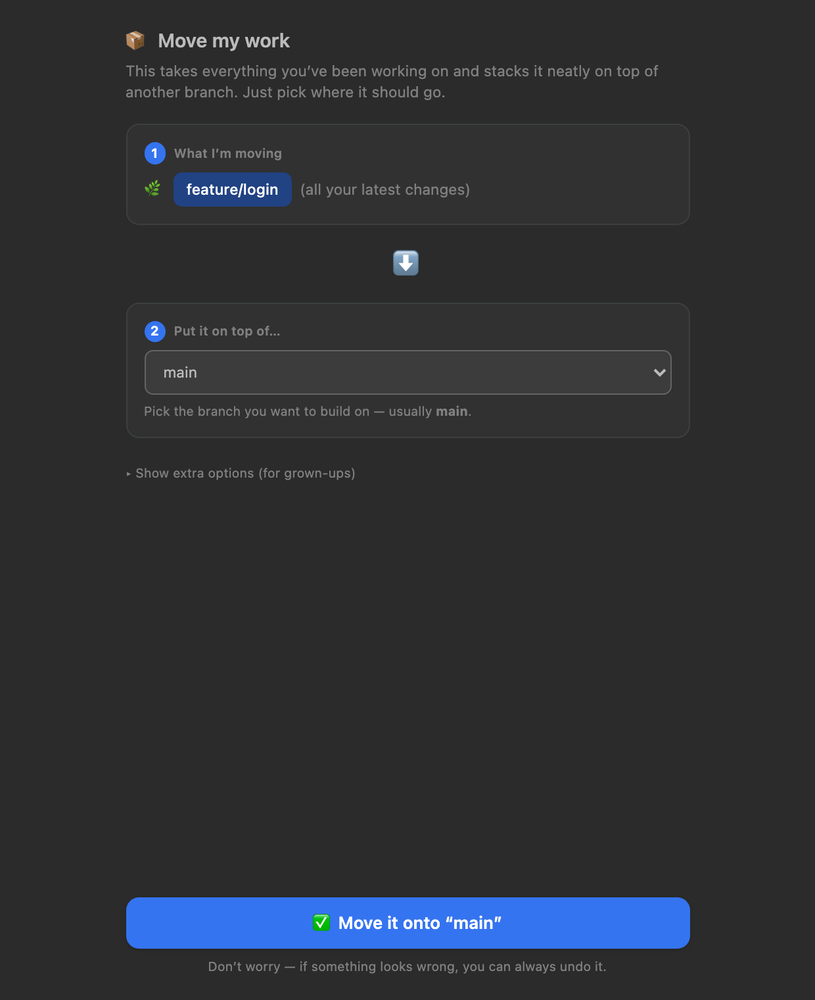
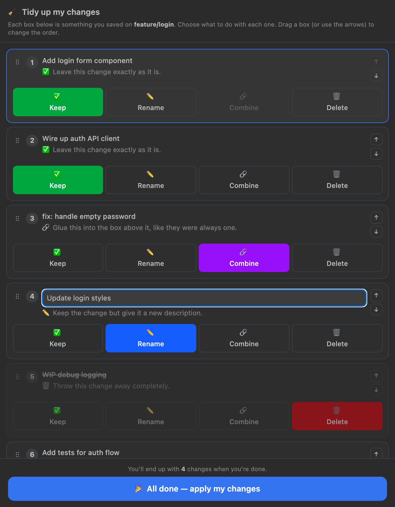
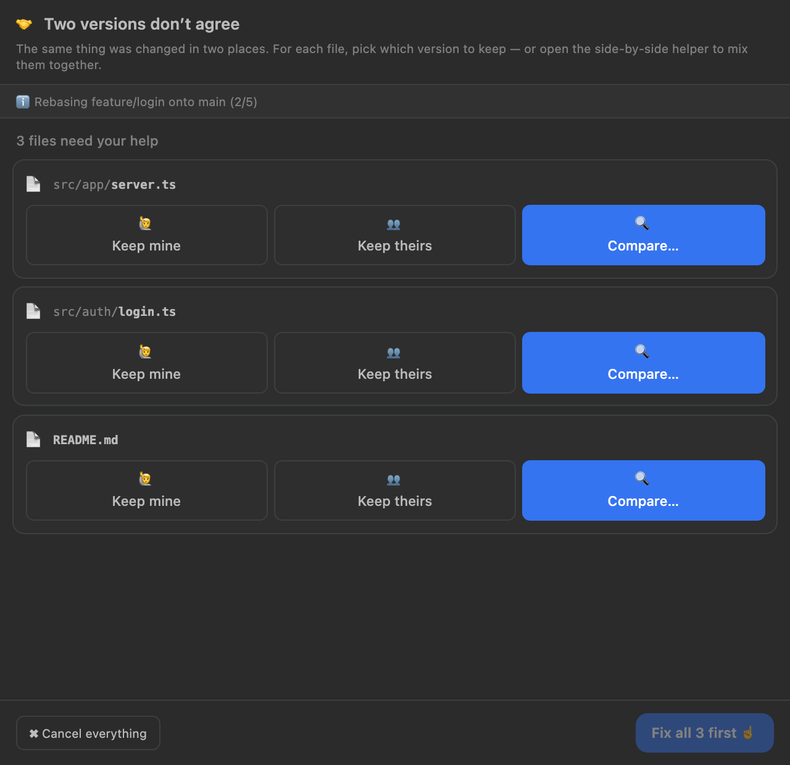
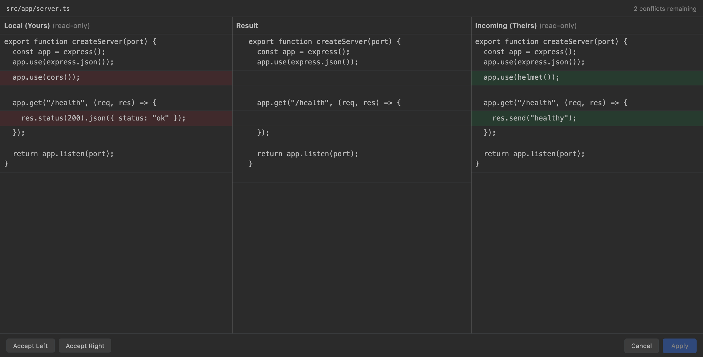

# IntelliGit — Visual Git Log & Rebase

A visual, beginner-friendly Git companion for VS Code. IntelliGit brings a clean
commit graph, a plain-language interactive rebase, and a side-by-side conflict
resolver right into the editor — inspired by the focused Git tooling found in
JetBrains IDEs, rebuilt natively for VS Code.

## Features

### Visual Git Log
A branch/commit graph with author, date, and refs, plus a detail panel — open it
from the **IntelliGit** panel or run **IntelliGit: Open Git Log**.

### Move my work (rebase, made simple)
A guided, two-step rebase dialog: pick the branch you're on, choose where to put
it, and go. Advanced flags (`--autostash`, `--no-verify`, …) are tucked away
until you need them.



### Tidy up my changes (interactive rebase)
Each commit becomes a card with four plain-language actions — **Keep**,
**Rename**, **Combine**, **Delete** — plus arrows to reorder. No cryptic
`pick/squash/fixup` todo file, and no surprise editor pop-ups.



### Conflict resolution
List every conflicted file with one-click **Accept Yours / Accept Theirs**, or
open the 3-way merge editor to resolve line-by-line. Continue or abort the
rebase/merge without leaving VS Code.





## Commands

| Command | Description |
| --- | --- |
| `IntelliGit: Open Git Log` | Open the commit graph panel |
| `IntelliGit: Rebase…` | Open the guided rebase dialog |
| `IntelliGit: Interactively Rebase from Here…` | Start an interactive rebase from a commit |
| `IntelliGit: Conflicts` | Show conflicted files |
| `IntelliGit: Refresh` | Reload the Git log |

## Requirements

- VS Code `^1.125.0`
- `git` available on your `PATH`

## Known limitations

- Interactive rebase exposes Keep / Rename / Combine / Delete and reordering. The
  `edit` (stop-to-amend) action is intentionally omitted to keep the flow simple.
- If a rebase hits a conflict mid-way, finish it from the Conflicts view.

## Development

```bash
pnpm install
pnpm run build      # bundle extension + webview
pnpm test           # type-check, lint, and run the test suite
```

Press `F5` in VS Code to launch the Extension Development Host.

### Contributing

All commits must follow the [Commit Convention](docs/COMMIT_CONVENTION.md).
Messages are validated locally by Husky and on every pull request in CI — non-conforming
commits are rejected.

Quick example:

```bash
git commit -m "feat(rebase): add autostash toggle to dialog"
```

## License

[MIT](LICENSE)
